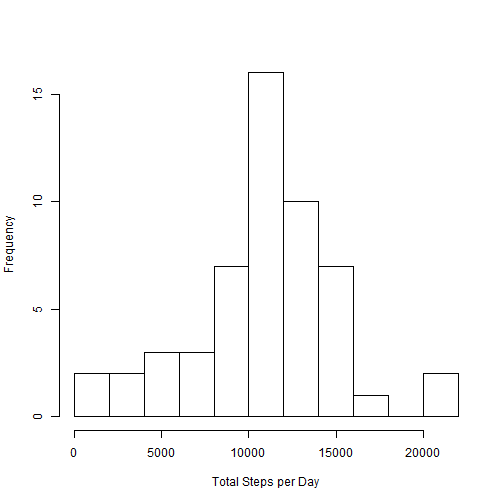
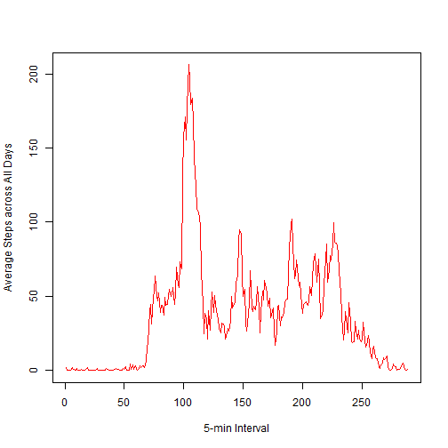

# Reproducible Research: Peer Assessment 1


## Loading and preprocessing the data


```r
setwd("C:/rwork/coursera-datasci/reproducible_research/")
df <- read.csv("RepData_PeerAssessment1//activity.csv")
df$date <- as.Date(df$date, format = "%Y-%m-%d")
```


## What is mean total number of steps taken per day?

```r
tot <- aggregate(steps ~ date, df, sum)
hist(tot$steps, xlab = "Total Steps per Day", main = "", breaks = 10)
```

 

```r
mean(tot$steps)
```

```
## [1] 10766
```

```r
median(tot$steps)
```

```
## [1] 10765
```


## What is the average daily activity pattern?

```r
library(zoo)
```

```
## Warning: package 'zoo' was built under R version 3.0.3
```

```
## 
## Attaching package: 'zoo'
## 
## The following objects are masked from 'package:base':
## 
##     as.Date, as.Date.numeric
```

```r
plot(df$steps, type = "l", col = "blue", xlab = "5-min Interval", ylab = "Steps")
```

 

```r

num_intervals <- 288
mean_steps <- rep(0, num_intervals)
for (i in seq(1:num_intervals)) {
    mean_steps[i] <- mean(df[seq(from = i, to = nrow(df), by = num_intervals), 
        "steps"], na.rm = T)
}

plot(mean_steps, type = "l", col = "red", xlab = "5-min Interval", ylab = "Average Steps across All Days")
```

 

```r

# 5-minute interval with maximum average steps:
which(max(mean_steps) == mean_steps)
```

```
## [1] 104
```


## Imputing missing values

```r
sum(is.na(df$steps))
```

```
## [1] 2304
```

```r
replaceNA <- function(value, index) {
    if (is.na(value)) {
        idx <- index%%num_intervals
        if (!idx) {
            idx <- num_intervals
        }
        mean_steps[idx]
    } else {
        value
    }
}

df$adjsteps <- as.numeric(mapply(replaceNA, df$steps, seq_along(df$steps)))
tot <- aggregate(adjsteps ~ date, df, sum)
hist(tot$adjsteps, xlab = "Total Steps per Day", main = "", breaks = 10)
```

 

### Median of adjusted 'steps' variable is one step higher:

```r

mean(tot$adjsteps)
```

```
## [1] 10766
```

```r
median(tot$adjsteps)
```

```
## [1] 10766
```


## Are there differences in activity patterns between weekdays and weekends?

```r
daytype <- function(x) {
    if (weekdays(x) %in% c("Saturday", "Sunday")) {
        "weekend"
    } else {
        "weekday"
    }
}
df$day <- lapply(df$date, daytype)
wk_step_mean <- data.frame(day = character(), mean = numeric())
for (i in seq(1:num_intervals)) {
    df.interval <- df[seq(from = i, to = nrow(df), by = num_intervals), c("day", 
        "adjsteps")]
    agg <- aggregate(adjsteps ~ unlist(day), df.interval, mean)
    wk_step_mean <- rbind(wk_step_mean, agg[, 1:2])
}
names(wk_step_mean) <- c("day", "mean-steps")
par(mfrow = c(2, 1))
plot(wk_step_mean[wk_step_mean$day == "weekday", 2], main = "Weekday", type = "l", 
    xlab = "Interval", ylab = "No. of Steps")
plot(wk_step_mean[wk_step_mean$day == "weekend", 2], main = "Weekend", type = "l", 
    xlab = "Interval", ylab = "No. of Steps")
```

 


